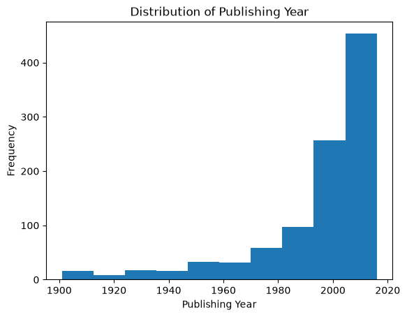
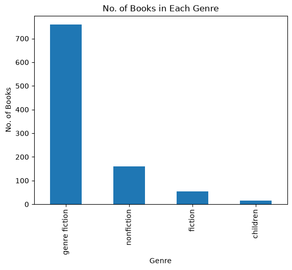
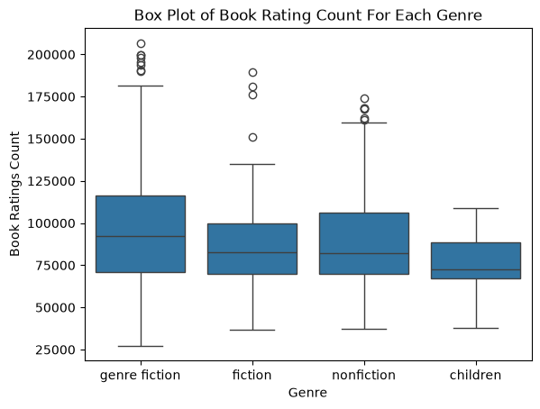
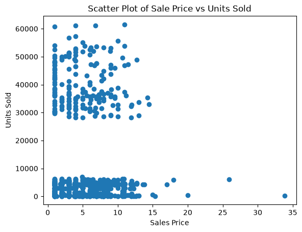
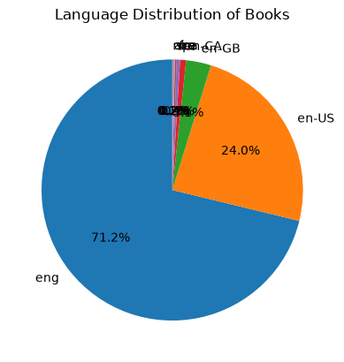
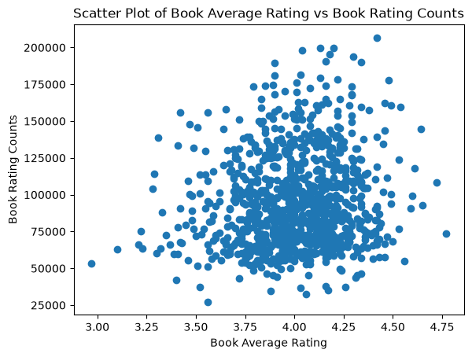
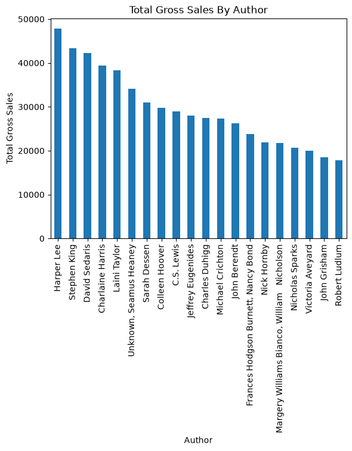
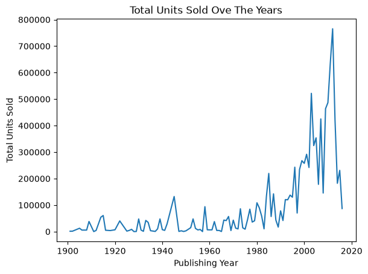

# 📚 Books Data Analysis

<p align="center">
  
</p>

<p align="center">


</p>

<p align="center">
An End-to-End Exploratory Data Analysis (EDA) project that uncovers meaningful insights from a Books dataset using Python and data visualization.
</p>

---

# 📖 Project Overview

Books contain valuable information about reader preferences, publishing trends, author performance, and sales patterns. This project performs a complete **Exploratory Data Analysis (EDA)** on a Books dataset to clean the data, analyze important features, and generate business insights using Python.

The project follows a real-world data analysis workflow, including data preprocessing, visualization, and insight generation.

---

# 🎯 Project Objectives

- Import and inspect the dataset
- Clean and preprocess the data
- Handle missing values
- Remove invalid records
- Check duplicate entries
- Analyze publishing year trends
- Study genre distribution
- Evaluate author performance
- Explore publisher revenue
- Analyze language distribution
- Investigate sales trends
- Generate business insights through visualizations

---

# 📂 Dataset Description

The dataset contains information about books, authors, ratings, sales, and publishers.

### Features

| Column | Description |
|---------|-------------|
| Book Name | Name of the book |
| Author | Author of the book |
| Publishing Year | Year of publication |
| Publisher | Publishing company |
| Genre | Book genre |
| Language | Language of publication |
| Average Rating | Average user rating |
| Ratings Count | Number of ratings |
| Gross Sales | Total sales generated |
| Sale Price | Selling price |
| Publisher Revenue | Revenue earned by publisher |
| Units Sold | Number of copies sold |

---

# 🛠️ Tech Stack

- Python
- Pandas
- NumPy
- Matplotlib
- Seaborn
- Jupyter Notebook

---

# 📊 Project Workflow

```
Books Dataset
      │
      ▼
Data Import
      │
      ▼
Data Inspection
      │
      ▼
Data Cleaning
      │
      ▼
Exploratory Data Analysis
      │
      ▼
Data Visualization
      │
      ▼
Business Insights
```

---

# 🧹 Data Cleaning

The following preprocessing steps were performed:

✅ Imported the dataset

✅ Inspected the dataset structure

✅ Generated descriptive statistics

✅ Removed invalid publishing years

✅ Checked missing values

✅ Removed records with missing book names

✅ Checked duplicate records

✅ Examined unique values in each column

---

# 📈 Exploratory Data Analysis

The following analyses were performed:

- 📅 Publishing Year Distribution
- 📚 Genre Distribution
- ⭐ Average Rating by Author
- 📊 Book Rating Count by Genre
- 💰 Sale Price vs Units Sold
- 🌍 Language Distribution
- 🏢 Publisher Revenue Analysis
- ⭐ Author Rating Category Analysis
- 📖 Language Frequency Analysis
- 📈 Average Rating vs Rating Count
- 💵 Gross Sales by Author
- 📦 Units Sold Over Time

---

# 📸 Project Visualizations

## 🖼️ Project Banner

<p align="center">

</p>

---

## 📅 Publishing Year Distribution

Shows how book publications have changed over time.

<p align="center">

</p>

---

## 📚 Genre Distribution

Displays the number of books available in each genre.

<p align="center">

</p>

---

## 📊 Book Rating Count by Genre

Compares rating counts across different genres.

<p align="center">

</p>

---

## 💲 Sale Price vs Units Sold

Explores the relationship between sale price and units sold.

<p align="center">

</p>

---

## 🌍 Language Distribution

Shows the percentage distribution of books by language.

<p align="center">

</p>

---

## ⭐ Average Rating vs Rating Count

Analyzes whether highly rated books also receive more ratings.

<p align="center">

</p>

---

## 💰 Gross Sales by Author

Highlights authors with the highest gross sales.

<p align="center">

</p>

---

## 📈 Units Sold Over Time

Shows how book sales changed across publishing years.

<p align="center">

</p>

---

# 🔍 Key Insights

- Most books in the dataset were published after the 1990s.
- Fiction is the most represented genre.
- English is the dominant publication language.
- Some authors consistently receive higher average ratings.
- Publisher revenue varies significantly across publishers.
- Books with higher ratings do not always have more ratings.
- Publishing activity and units sold have generally increased over time.

---

# 📁 Project Structure

```
Books-Data-Analysis
│
├── data
│   └── Books_Data_Clean.csv
│
├── notebooks
│   └── Books_Data_Analysis.ipynb
│
├── images
│   ├── banner.png
│   ├── publishing_year_distribution.png
│   ├── genre_distribution.png
│   ├── book_rating_count_by_genre.png
│   ├── sale_price_vs_units_sold.png
│   ├── language_distribution.png
│   ├── average_rating_vs_rating_count.png
│   ├── gross_sales_by_author.png
│   └── units_sold_over_time.png
│
├── reports
│   └── Books_Data_Analysis_Project.pdf
│
├── requirements.txt
├── LICENSE
└── README.md
```

---

# 🚀 Getting Started

## Clone the Repository

```bash
git clone https://github.com/nsr-dev-in/Books-Data-Analysis.git
```

## Navigate to the Project

```bash
cd Books-Data-Analysis
```

## Install Required Libraries

```bash
pip install -r requirements.txt
```

## Launch Jupyter Notebook

```bash
jupyter notebook
```

Open:

```
Books_Data_Analysis.ipynb
```

---

# 📌 Future Improvements

- Interactive Power BI Dashboard
- Book Recommendation System
- Machine Learning for Rating Prediction
- Sales Forecasting
- Streamlit Web Application
- Interactive Dashboard with Plotly

---

# 📄 Project Report

A detailed project report explaining the data cleaning process, EDA workflow, visualizations, and key insights is included in the repository.

---

# 👨‍💻 Author

## Nitin Singh

📌 Aspiring Data Analyst

💻 Python | SQL | Power BI | Excel | Data Visualization

🔗 GitHub: https://github.com/nsr-dev-in

🔗 LinkedIn: https://www.linkedin.com/in/YOUR-LINKEDIN/

---

# 🤝 Connect With Me

If you found this project useful or have suggestions for improvement, feel free to connect or reach out. Feedback is always appreciated!

---

# ⭐ Support

If you like this project, don't forget to **Star ⭐ the repository** and share it with others.

---

# 📜 License

This project is licensed under the **MIT License**.
