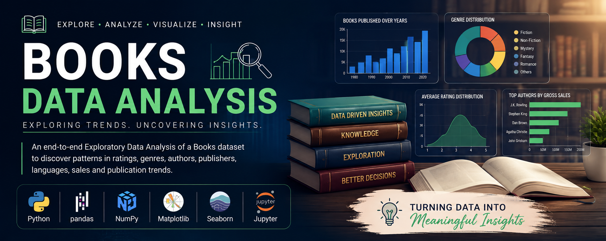

# 📚 Books Data Analysis

<p align="center">
  
</p>

<p align="center">


</p>

---

# 📖 Project Overview

This project performs **Exploratory Data Analysis (EDA)** on a Books dataset using Python. The primary objective is to clean the dataset, analyze important trends, and generate meaningful insights related to books, authors, publishers, ratings, languages, sales, and publication years.

The project demonstrates the complete EDA workflow followed by data analysts, including data preprocessing, statistical analysis, and visualization.

---

# 🎯 Project Objectives

- Import and inspect the dataset
- Perform data cleaning
- Handle missing values
- Remove invalid records
- Check duplicate entries
- Analyze publishing trends
- Study book genres
- Analyze author performance
- Explore publisher revenue
- Understand language distribution
- Visualize sales trends
- Generate actionable insights

---

# 📂 Dataset Information

The dataset contains information about books, including:

- Book Name
- Author
- Publishing Year
- Publisher
- Genre
- Language
- Average Rating
- Rating Count
- Gross Sales
- Sale Price
- Publisher Revenue
- Units Sold

---

# 🛠️ Tech Stack

- Python
- Jupyter Notebook
- Pandas
- NumPy
- Matplotlib
- Seaborn

---

# 📊 Project Workflow

```
Books Dataset
      │
      ▼
Data Import
      │
      ▼
Data Inspection
      │
      ▼
Data Cleaning
      │
      ▼
Exploratory Data Analysis
      │
      ▼
Data Visualization
      │
      ▼
Business Insights
```

---

# 🧹 Data Cleaning

The following preprocessing steps were performed:

✔ Loaded the dataset

✔ Inspected dataset structure

✔ Generated descriptive statistics

✔ Removed invalid publishing years

✔ Checked missing values

✔ Removed rows with missing book names

✔ Checked duplicate records

✔ Examined unique values across columns

---

# 📈 Exploratory Data Analysis

The following analyses were performed:

## 📅 Publishing Year Distribution

- Distribution of books by publishing year
- Identified publication trends over time

---

## 📚 Genre Distribution

- Number of books in each genre
- Most popular book categories

---

## ✍️ Author Analysis

- Average rating by author
- Gross sales by author
- Highest-performing authors

---

## ⭐ Rating Analysis

- Average Rating vs Rating Count
- Book Rating Count by Genre
- Variance of Ratings

---

## 🌍 Language Analysis

- Language distribution
- Frequency of books in each language

---

## 🏢 Publisher Analysis

- Publisher Revenue
- Highest revenue-generating publishers

---

## 💰 Sales Analysis

- Sale Price vs Units Sold
- Units Sold over Publishing Years
- Gross Sales Analysis

---

# 📉 Visualizations

The project includes multiple visualizations such as:

- Histogram
- Bar Chart
- Pie Chart
- Box Plot
- Scatter Plot
- Line Chart

---

# 🔍 Key Insights

- Most books were published after the 1990s.
- Fiction dominates the dataset compared to other genres.
- English is the most common publication language.
- Certain authors consistently achieve higher average ratings.
- Publisher revenue varies significantly across publishers.
- Higher ratings do not always correspond to a higher number of ratings.
- Sales trends show noticeable growth in recent publication years.

---

# 📁 Project Structure

```
Books-Data-Analysis
│
├── data
│   └── Books_Data_Clean.csv
│
├── notebooks
│   └── Books_Data_Analysis.ipynb
│
├── images
│   ├── publishing_year_distribution.png
│   ├── genre_distribution.png
│   ├── language_distribution.png
│   ├── gross_sales_by_author.png
│   ├── publisher_revenue.png
│   └── average_rating_vs_rating_count.png
│
├── reports
│   └── Project_Report.pdf
│
├── requirements.txt
├── LICENSE
└── README.md
```

---

# 🚀 How to Run

### Clone Repository

```bash
git clone https://github.com/nsr-dev-in/Books-Data-Analysis.git
```

### Install Dependencies

```bash
pip install -r requirements.txt
```

### Launch Jupyter Notebook

```bash
jupyter notebook
```

Open:

```
Books_Data_Analysis.ipynb
```

---

# 📌 Future Improvements

- Interactive Power BI Dashboard
- Book Recommendation System
- Machine Learning Models
- Sales Forecasting
- Interactive Streamlit Application

---

# 👨‍💻 Author

**Nitin Singh**

📧 Email: nsr2k06@example.com

🔗 GitHub: https://github.com/nsr-dev-in

🔗 LinkedIn: https://linkedin.com/in/nsr2k06

---

# ⭐ Support

If you found this project useful, consider giving it a **⭐ Star** on GitHub.

It helps support future open-source projects and encourages continuous learning.

---

## 📜 License

This project is licensed under the **MIT License**.
